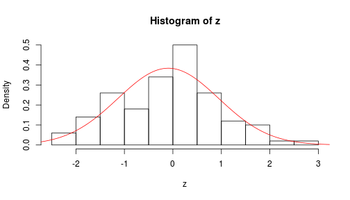

First R
========================================================

All the regular mathematical operations can be carried out. 

```r
# First R session
4 + 5
4 * 5
4/5
4^5
sqrt(5)
log(5)

test <- 2 * 3
test

test = 2/3
test
```

R Objects
----------------------------------------------------------
R uses objects. The main objects are:
* numeric
* character
* logical 

Character
-----------------------------------------------------
For an example of character

```r
a <- "My name"
a
```

```
## [1] "My name"
```


Vectors and matrices
-----------------------------------------------------
Strings or numerics can be concatonated or combined to form a vector or matrix

```r
mynumbers <- c(3, 5, 6, 7, 9)
mynumbers
```

```
## [1] 3 5 6 7 9
```

```r
mynumbers <- c(1:10)
mynumbers
```

```
##  [1]  1  2  3  4  5  6  7  8  9 10
```

To create a sequence, use the command sequence

```r
a <- seq(0.5, 2.5, length = 100)
a
```

```
##   [1] 0.5000 0.5202 0.5404 0.5606 0.5808 0.6010 0.6212 0.6414 0.6616 0.6818
##  [11] 0.7020 0.7222 0.7424 0.7626 0.7828 0.8030 0.8232 0.8434 0.8636 0.8838
##  [21] 0.9040 0.9242 0.9444 0.9646 0.9848 1.0051 1.0253 1.0455 1.0657 1.0859
##  [31] 1.1061 1.1263 1.1465 1.1667 1.1869 1.2071 1.2273 1.2475 1.2677 1.2879
##  [41] 1.3081 1.3283 1.3485 1.3687 1.3889 1.4091 1.4293 1.4495 1.4697 1.4899
##  [51] 1.5101 1.5303 1.5505 1.5707 1.5909 1.6111 1.6313 1.6515 1.6717 1.6919
##  [61] 1.7121 1.7323 1.7525 1.7727 1.7929 1.8131 1.8333 1.8535 1.8737 1.8939
##  [71] 1.9141 1.9343 1.9545 1.9747 1.9949 2.0152 2.0354 2.0556 2.0758 2.0960
##  [81] 2.1162 2.1364 2.1566 2.1768 2.1970 2.2172 2.2374 2.2576 2.2778 2.2980
##  [91] 2.3182 2.3384 2.3586 2.3788 2.3990 2.4192 2.4394 2.4596 2.4798 2.5000
```

```r
b <- seq(1, 10, 1)
b
```

```
##  [1]  1  2  3  4  5  6  7  8  9 10
```

```r
mynumbers <- 1:12
m <- matrix(mynumbers, nrow = 4)
m
```

```
##      [,1] [,2] [,3]
## [1,]    1    5    9
## [2,]    2    6   10
## [3,]    3    7   11
## [4,]    4    8   12
```

The plot function will allow you to create graphs with the data that you have. 

```r
x <- seq(-pi, pi, length = 10)
y <- sin(x)
plot(x, y)
lines(x, y)
```

 

If you change the length of the x variable to 100 you will get a smoother line. 

```r
x <- seq(-pi, pi, length = 100)
y <- sin(x)
plot(x, y)
lines(x, y)
```

 


```r
z <- rnorm(100)
hist(z, prob = TRUE)
mu <- mean(z)
sig <- sd(z)
x <- seq(-4, 4, length = 500)
y <- dnorm(x, mu, sig)
lines(x, y, col = "red")
```

 

