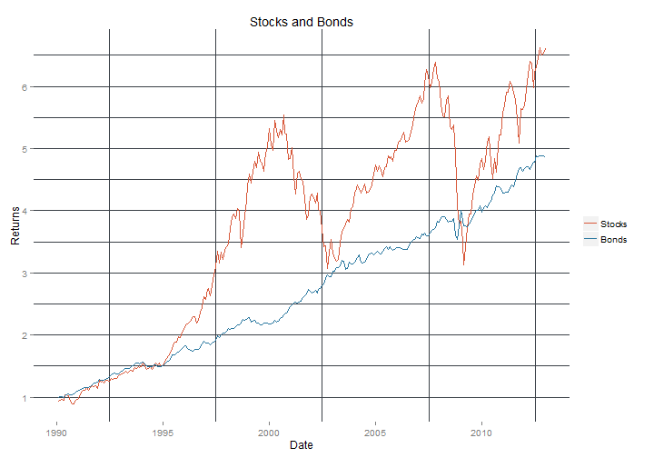

Using Quandl
========================================================
QUandl is an open source collector of data.  It is mostly economic data from a number of official and semi-official sources. 

The site is [http://www.quandl.com/](http://www.quandl.com/)
This is an unashamed reproduction of somethinng that appeared on the Quandl blog. 

The 60:40 rule
----------------------------
This is from [http://blog.quandl.com/blog/using-r-to-model-the-classic-6040-investing-rule/](http://blog.quandl.com/blog/using-r-to-model-the-classic-6040-investing-rule/).  You will need to register to the site and get an API key to make the work most effectively. 


```r
require(Quandl)
# Quandl and ggplot package
Quandl.auth("mUCjthkJFQDsYVrFh4Gh")
AAA <- Quandl("ML/AAATRI", start_date = "1990-01-01", end_date = "2012-12-31", 
    collapse = "monthly")
TR <- Quandl("SANDP/MONRETS", start_date = "1990-01-01", end_date = "2012-12-31")
class(AAA)
```

```
## [1] "data.frame"
```

```r
head(AAA)
```

```
##         Date Value
## 1 2012-12-31 544.8
## 2 2012-11-30 547.0
## 3 2012-10-31 547.3
## 4 2012-09-30 546.2
## 5 2012-08-31 545.4
## 6 2012-07-31 546.1
```

This is the data.frame that has been downloaded from Quandl.  

```r
require(ggplot2)
```

```
## Loading required package: ggplot2
```

```r
Time <- rev(TR[, 1])
TR <- apply(TR[-1], 2, rev)
# We now pretend as if we invested 1 dollar in 1990.
bond <- rev(AAA[, 2])/tail(AAA[, 2], 1)
stock <- NULL
for (i in 1:NROW(TR)) {
    stock[i] <- cumsum(prod((1 + TR[1:i, 11])))
}
# Graphical Parameters:
stockframe = data.frame(value = stock, Date = Time)
bondframe = data.frame(value = bond, Date = Time)
line.plot <- ggplot() + geom_line(data = stockframe, aes(x = Date, y = value, 
    colour = "Stocks")) + geom_line(data = bondframe, aes(x = Date, y = value, 
    colour = "Bonds")) + scale_colour_manual("", breaks = c("Stocks", "Bonds"), 
    values = c("#29779f", "#d8593b")) + theme(panel.background = element_rect(fill = "#FFFFFF"), 
    panel.grid.major.x = element_blank(), panel.grid.major.y = element_line(colour = "#3a4047", 
        size = 0.1), panel.grid.minor = element_line(colour = "#3a4047", size = 0.1)) + 
    xlab("Date") + ylab("Returns") + ggtitle("Stocks and Bonds")
line.plot
```

 

