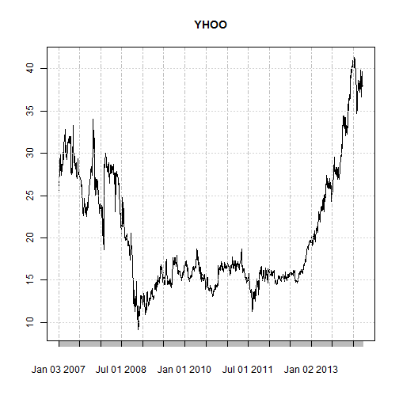
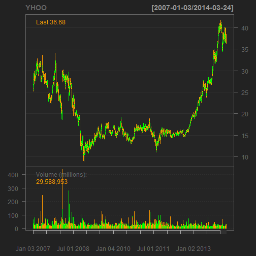
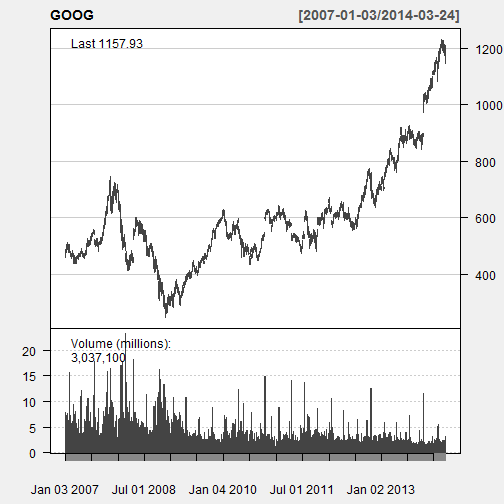
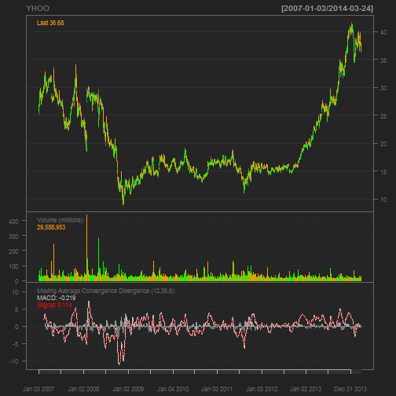
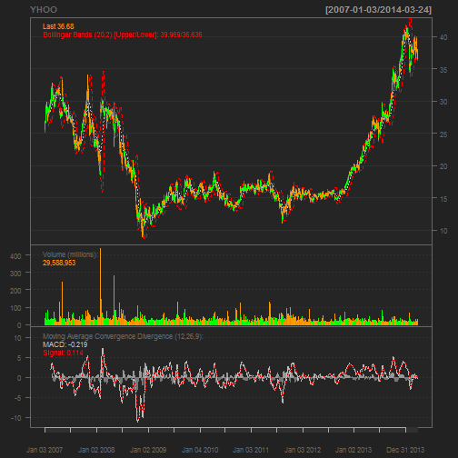
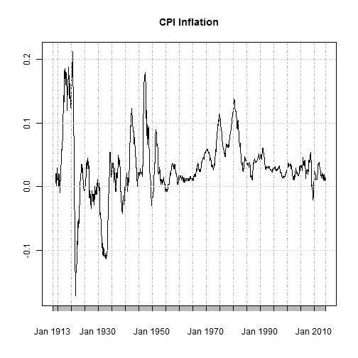

Quantmod examples
========================================================

```r
require(quantmod)
getSymbols("BAC")
```

```
## [1] "BAC"
```

```r
plot(BAC)
```

 

```r
head(BAC)
```

```
##            BAC.Open BAC.High BAC.Low BAC.Close BAC.Volume BAC.Adjusted
## 2007-01-03    53.40    54.18   52.99     53.33   16028200        45.97
## 2007-01-04    53.33    53.89   53.05     53.67   13175000        46.26
## 2007-01-05    53.59    53.59   53.03     53.24   10205000        45.89
## 2007-01-08    53.46    53.64   52.80     53.45    9685900        46.07
## 2007-01-09    53.60    53.71   52.97     53.50   12546500        46.12
## 2007-01-10    53.26    53.70   53.16     53.58   10083900        46.19
```

```r
tail(BAC)
```

```
##            BAC.Open BAC.High BAC.Low BAC.Close BAC.Volume BAC.Adjusted
## 2014-03-14    17.08    17.22   16.76     16.80  130844700        16.80
## 2014-03-17    16.98    17.17   16.97     17.11   79714900        17.11
## 2014-03-18    17.14    17.22   17.07     17.19   66313100        17.19
## 2014-03-19    17.16    17.49   17.12     17.44  104005900        17.44
## 2014-03-20    17.44    18.00   17.43     17.92  166538700        17.92
## 2014-03-21    18.03    18.03   17.56     17.56  155721000        17.56
```

```r
head(Ad(BAC))
```

```
##            BAC.Adjusted
## 2007-01-03        45.97
## 2007-01-04        46.26
## 2007-01-05        45.89
## 2007-01-08        46.07
## 2007-01-09        46.12
## 2007-01-10        46.19
```

```r
`?`(quantmod)
`?`(OHLC)
```

```
## Help on topic 'OHLC' was found in the following packages:
## 
##   Package               Library
##   quantmod              /home/rob/R/i686-pc-linux-gnu-library/2.14
##   xts                   /home/rob/R/i686-pc-linux-gnu-library/2.14
## 
## 
## Using the first match ...
```

There are a number of built in plotting functions. 

```r
barChart(BAC)
```

```
## Error: could not find function "barChart"
```

```r
addTA(EMA(Cl(BAC)), on = 1, col = 6)
```

```
## Error: could not find function "addTA"
```

The getSymbols function can draw data from a number of different sources. 

```r
getSymbols("YHOO", src = "google")  # from google finance
```

```
## [1] "YHOO"
```

```r
plot(YHOO)
```

 

```r
getSymbols("GOOG", src = "yahoo")  # from yahoo finance
```

```
## [1] "GOOG"
```

```r
plot(GOOG)
```

 

```r
getSymbols("DEXJPUS", src = "FRED")  # FX rates from FRED
```

```
## [1] "DEXJPUS"
```

```r
plot(DEXJPUS)
```

 

```r
barChart(YHOO)
```

 

```r
candleChart(GOOG, multi.col = TRUE, theme = "white")
```

 

```r
require(TTR)
chartSeries(YHOO)
```

 

```r
addMACD()
```

 

```r
addBBands()
```

 

Once of the sources is the Fred database.  Here we get the data and chart it in different ways. 

```r
getSymbols("CPIAUCNS", src = "FRED")
```

```
## [1] "CPIAUCNS"
```

```r
plot(CPIAUCNS)
```

 

```r
plot(diff(log(CPIAUCNS)))
```

 

```r
plot(diff(log(CPIAUCNS), lag = 12), main = "CPI Inflation")
```

 

