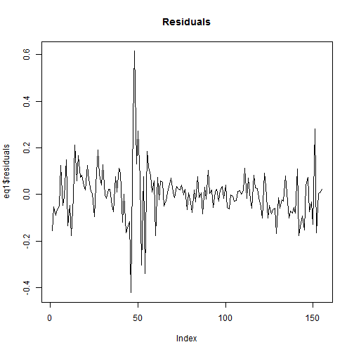
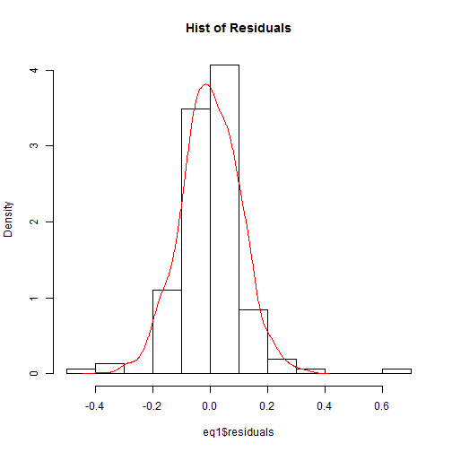

Regression
========================================================
OLS
----------------------------------------------------------
Load the BAc data into R.  Use the lm function to create a linar model. Use \?lm or F1 in R-studio to find out more about the function. 

```r
da <- read.csv("../../Data/BAC.csv")
head(da)
```

```
##         Date   BAC   SPY
## 1 03/12/2012 11.58 139.6
## 2 01/11/2012  9.82 138.4
## 3 01/10/2012  9.28 137.6
## 4 04/09/2012  8.79 140.1
## 5 01/08/2012  7.95 136.7
## 6 02/07/2012  7.30 133.3
```

```r
BACr <- diff(log(da$BAC))
SPYr <- diff(log(da$SPY))
eq1 <- lm(BACr ~ SPYr)
summary(eq1)
```

```
## 
## Call:
## lm(formula = BACr ~ SPYr)
## 
## Residuals:
##     Min      1Q  Median      3Q     Max 
## -0.4215 -0.0574  0.0038  0.0483  0.6146 
## 
## Coefficients:
##             Estimate Std. Error t value Pr(>|t|)    
## (Intercept)  0.00472    0.00906    0.52      0.6    
## SPYr         1.64937    0.19559    8.43  2.3e-14 ***
## ---
## Signif. codes:  0 '***' 0.001 '**' 0.01 '*' 0.05 '.' 0.1 ' ' 1
## 
## Residual standard error: 0.113 on 153 degrees of freedom
## Multiple R-squared:  0.317,	Adjusted R-squared:  0.313 
## F-statistic: 71.1 on 1 and 153 DF,  p-value: 2.35e-14
```

Note that summary will provide a summary of the object and will provide information that is appropriate to the object that is being summarised.  

The LM Object
----------------------------
Note that an LM object is a list.  The following components can be useful
* Coefficients
* residuals
* fitted.values
df.residual

The full list can be uncovered by asking for the names


```r
names(eq1)
```

```
##  [1] "coefficients"  "residuals"     "effects"       "rank"         
##  [5] "fitted.values" "assign"        "qr"            "df.residual"  
##  [9] "xlevels"       "call"          "terms"         "model"
```

```r
plot(eq1$residuals, type = "l", main = "Residuals")
```

 

Or look at a histogram of the residuals

```r
x <- mean(eq1$residuals)
y <- sd(eq1$residuals)
norm.sim <- rnorm(1000, x, y)
hist(eq1$residuals, prob = TRUE, main = "Hist of Residuals")
lines(density(norm.sim), col = "red")
```

 


