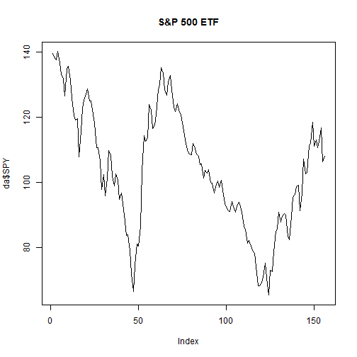

Writing data and useing Dataframes
========================================================

Writing data
---------------------------------------------
One of the main things that you want to be able to do is to draw in data so that you can analyse and produce graphics.  The file BAC.csv should be saved to a specific location (ideally the working directory)

The working directory is where R will look for inforamtion (data and code mainly).  You can change this using the command cd or the menu system

The command to read files of data into R is "read.table".  A particular version of this which is useful for excel files converted to "comma separated variable" (CAV) file is "read.csv".  You can find out more about this from the usual place. 

```r
da <- read.csv("C://Users/Toshiba/Desktop/bac.csv")
head(da)
```

```
##         Date   BAC   SPY
## 1 03/12/2012 11.58 139.6
## 2 01/11/2012  9.82 138.4
## 3 01/10/2012  9.28 137.6
## 4 04/09/2012  8.79 140.1
## 5 01/08/2012  7.95 136.7
## 6 02/07/2012  7.30 133.3
```

As you are now using a larger file and we do not want to open the spreadsheet, it is possible to use the commands "summary" and "str" to take a look.


```r
summary(da)
```

```
##          Date          BAC             SPY       
##  01/02/2000:  1   Min.   : 3.87   Min.   : 65.5  
##  01/02/2001:  1   1st Qu.:14.26   1st Qu.: 91.0  
##  01/02/2002:  1   Median :23.16   Median :103.3  
##  01/02/2005:  1   Mean   :24.44   Mean   :104.1  
##  01/02/2006:  1   3rd Qu.:35.17   3rd Qu.:118.6  
##  01/02/2007:  1   Max.   :46.45   Max.   :140.1  
##  (Other)   :150
```

```r
str(da)
```

```
## 'data.frame':	156 obs. of  3 variables:
##  $ Date: Factor w/ 156 levels "01/02/2000","01/02/2001",..: 152 91 81 156 65 119 47 37 112 20 ...
##  $ BAC : num  11.58 9.82 9.28 8.79 7.95 ...
##  $ SPY : num  140 138 138 140 137 ...
```

The Date has been downloaded as a "Factor".  This is just a categorial object.  In this case there are 156 categories (because there are 156 months of data).  Factors are useful if we have data like sex (two factors: male, female), investment profile (three factors:  high risk, medium risk, low risk) etc. It would be better in this case if R treated the dates as a date. 


```r
da <- read.csv("C://Users/Toshiba/Desktop/bac.csv", stringsAsFactors = FALSE)
da$Date <- as.Date(da$Date, format = "%m/%d/%Y")
str(da)
```

```
## 'data.frame':	156 obs. of  3 variables:
##  $ Date: Date, format: "2012-03-12" "2012-01-11" ...
##  $ BAC : num  11.58 9.82 9.28 8.79 7.95 ...
##  $ SPY : num  140 138 138 140 137 ...
```


Dataframe
--------------------------------
A dataframe is like a matrix.  However, unlike a matrix, a dataframe can have a variety of classes.  It can combine numeric data with charcter strings or dates.  There are two main ways to access indivicual parts of a data.frame: use the column name or identify the row or column


```r
head(da$BAC)
```

```
## [1] 11.58  9.82  9.28  8.79  7.95  7.30
```

```r
plot(da$SPY, main = "S&P 500 ETF", type = "l")
```

 

```r
head(da[, 1])
```

```
## [1] "2012-03-12" "2012-01-11" "2012-01-10" "2012-04-09" "2012-01-08"
## [6] "2012-02-07"
```

```r
da[4, ]
```

```
##         Date  BAC   SPY
## 4 2012-04-09 8.79 140.1
```

The function "which" will return an index.  Therefore, if you ask which row = "2012-01-08", you will get [5,] and this can be used as the input. 


```r
da[which(da$Date == "2012-01-08"), ]
```

```
##         Date  BAC   SPY
## 5 2012-01-08 7.95 136.7
```

